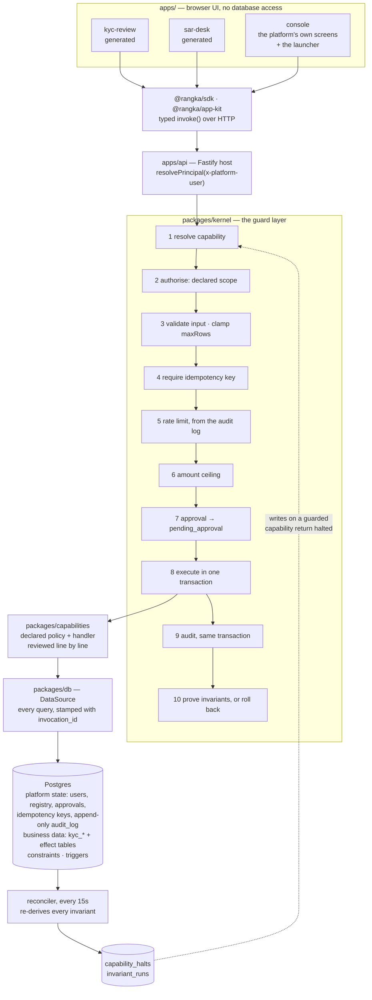

# Architecture

## The block diagram

One framework, one database, several apps — and one guard layer between them.



Read it as three claims. An app can say *what* it wants and nothing else. Everything between the
app and the row is fixed code the app cannot skip, reorder or configure. And the last box is
continuous: the same statements the runtime proved before commit are re-proved afterwards over
committed data, so drift that arrived by some other path still halts the capability it affects.

## The one decision everything follows from

Apps are generated. Review is the only human gate, and review is fallible. So the properties
that must never fail are not properties of app code — they are properties of the runtime.

Concretely: an application can express *what* it wants (`kyc.case.approve`, this case, at this
revision).
It cannot express *whether it is allowed*, *how often it may happen*, *who must approve*, or
*whether to write an audit record*. Those are decided by the runtime from a declaration attached
to the capability, and there is no code path that skips them.

## Layers

| Layer | Written by | Reviewed how | May touch |
| --- | --- | --- | --- |
| App (`apps/<app-name>`) | Devin | Skimmed — it cannot do damage | `@rangka/sdk`, `@rangka/app-kit` |
| Capability (`packages/capabilities`) | Devin from a human spec | Read in full, line by line | `ctx.data`, its own input |
| Runtime (`packages/kernel`) | Devin under phase C of the playbook | Read in full, with adversarial DB tests and a change record | Everything |
| Data (`packages/db`) | Devin under phase C of the playbook | Migrations reviewed; additive only | Postgres |

The boundary is mechanically enforced by `npm run lint`, which fails if app code imports the
kernel, the data layer, capability handlers, `pg`, or calls `fetch` directly — and, separately,
if a change edits the platform without a record under `docs/platform-changes/`, or registers an
invariant no test names. [The playbook](devin/playbook.md) triages which side of that line a request falls on.

## The invocation pipeline

Every call — read or write, allowed or denied — goes through `invoke()` in
`packages/kernel/src/runtime.ts`:

1. **Resolve** the capability from the registry. Unknown name → `not_found`.
2. **Authorise**: the principal's scopes must contain the capability's declared scope.
   Denials happen before input is even parsed, so a malformed hostile payload never reaches a
   schema written by a generator.
3. **Validate** input with the capability's Zod schema. Read capabilities have their `limit`
   clamped to the declared `maxRows`, so an app cannot ask for the whole table.
4. **Require an idempotency key** for every write. There is no way to opt out: the type demands
   `idempotent: true` and the runtime rejects writes without a key.
5. **Rate limit** from the audit log itself — accepted invocations per actor per capability per
   hour. The audit log being the source of truth means the limit cannot drift from the record.
6. **Amount ceiling**: the runtime reads the amount out of the validated input at the declared
   `amountField` and compares it to `maxAmountCents`. Over the ceiling is refused outright — no
   approval can override a ceiling, which is the difference between a limit and a threshold.
7. **Approval**: if the declared rule fires, the runtime persists the pending invocation and
   returns `pending_approval`. **The handler has not run.** Approval is not a UI convention here;
   it is a suspended invocation.
8. **Execute** inside one transaction. The handler receives a `DataSource` bound to that
   transaction and nothing else — no pool, no HTTP client, no vendor SDK.
9. **Audit** in the *same* transaction as the effect. An effect that commits without its audit
   record is not representable. Failures roll back the effect and are audited on a separate
   connection under the same invocation id, so denials and errors are recorded too.
10. **Prove the invariants** before commit. The invariants are re-derived inside the transaction
    from what it is about to commit; a violation aborts it, so the money never lands and only
    the audited refusal survives.

Writes are also refused up front (`halted`) while an invariant guarding that capability is violated.

## Invariants

An invariant is a statement about the data that must always be true, written as SQL that returns no
rows (`packages/kernel/src/invariants.ts`).

The set is **derived, not curated**. Two sources:

- **Axioms** — properties of the platform itself, true independently of any capability. Today:
  an approval is decided by someone other than its requester, and an effect nobody audited did
  not legitimately happen.
- **Declarations** — every write capability declares its policy (`maxAmountCents`, `approval`,
  `maxPerHour`, `idempotent`) and its `effect`: which table the row lands in, which column holds
  the amount moved, which rows count as live, and which finite pool it draws down. Each field
  generates the SQL that proves the committed data obeys it, so `kyc.case.approve` gets
  `carries_the_declared_approval`, `respects_declared_rate`, `is_idempotent`,
  `effects_are_attributed` and `happens_at_most_once_per_subject` without anyone writing a rule.
  A write capability that declares no effect does not register (`PolicyDeclarationError`) —
  there would be nothing to prove.

That is what stops the set being arbitrary: a rule exists because a declaration says something,
and changing the declaration changes the rule in the same commit.

The same definition is enforced in three places:

| Layer | Catches | Cost of being wrong |
| --- | --- | --- |
| Database constraints and triggers | anything, including a kernel bug or a human with `psql` | the write fails loudly |
| Postcondition in the writing transaction | a handler that did something its declaration did not describe | the effect rolls back, refusal is audited |
| Reconciler, every 15s | drift that arrived by a path the runtime never saw — manual UPDATE, restore, migration | the guarded capability halts |

Thresholds inside invariant queries are read from `capability_registry`, so an invariant is derived
from the declaration a human approved rather than being a second copy that can drift from it.

Every effect row carries the `invocation_id` of the audited invocation that produced it. The
`DataSource` stamps it, not the handler, and a trigger plus a foreign key to `audit_log` make an
unattributable effect unrepresentable — the property the reconciler's "did anyone actually decide
this?" question depends on.

On a violation the platform halts the capabilities the invariant names: writes return `halted`,
reads and everything else keep serving, and only `invariants:clear` (admin) resumes it, once every
invariant guarding it passes again. See [ADR 0006](adr/0006-invariants-are-enforced-three-times.md).

## Approvals

`decideApproval()` is the only place an approval grant can be minted, and an HTTP caller cannot
supply one. On approval the runtime **replays the original request as the original requester** —
the decision on a case is attributed to the reviewer who asked for it, not the officer who
allowed it — and the approval is itself an audited action. A requester may never approve their own
request.

The scope an approver must hold is fixed **when the request is raised** and stored on the row, so a
later edit to the declaration cannot retroactively lower the bar on a request already waiting. For
`derived_from_subject` the requirement is asked of the case in SQL, from the declared clauses:
`kyc.case.approve` on a case with an unresolved OFAC hit demands `kyc:sar`, on a merely high-risk
case demands a second `kyc:decide`, and on a clean low-risk case demands nobody. `kyc.cases.get`
returns the same answer to the app so a reviewer can be warned before acting, without the app
holding a copy of the rule.

## What a policy declaration looks like

```ts
policy: {
  scope: "kyc:decide",
  idempotent: true,
  limits: { maxAmountCents: null, maxPerHour: 50 },
  subject: { table: "kyc_cases", idField: "caseId" },
  approval: {
    mode: "derived_from_subject",
    clauses: [
      { when: "…unresolved OFAC/EU/UK hit…", approverScope: "kyc:sar", because: "…" },
      { when: "s.risk_band = 'high' or …any unresolved hit…", approverScope: "kyc:decide", because: "…" },
    ],
  },
  approverScope: "kyc:decide",
  effect: { table: "kyc_case_decisions", subjectColumn: "case_id", oncePerSubject: true },
}
```

That block is the review artifact. Reviewing *"is this handler correct?"* is hard and subjective;
reviewing *"should a compliance officer be able to onboard a clean low-risk applicant alone, but
never one with an unresolved sanctions hit?"* is a question a risk owner can answer in seconds.
Malformed declarations fail at boot, not at the first case: a ceiling with no `amountField`, or a
write with no `effect`, refuses to register.

## Identity

`resolvePrincipal()` maps a user to a role, and a role to scopes. The dev implementation trusts an
`x-platform-user` header; production replaces that function alone. Capabilities declare scopes,
never roles, so adding a role never touches capability code.

## Postgres

One database, two concerns, deliberately: platform state (`platform_users`,
`capability_registry`, `approvals`, `idempotency_keys`, `audit_log`) and business data
(`kyc_cases` and its documents, screening hits and risk signals, plus the effect tables
`kyc_case_decisions`, `kyc_pii_disclosures`, `kyc_sars` and `kyc_case_events`), plus the
reconciliation record (`invariant_runs`, `capability_halts`). They share a
database so that an effect and its audit record commit atomically — the property that makes the
audit log trustworthy. See [ADR 0004](adr/0004-postgres-as-system-of-record.md) for the cost of
that choice.
